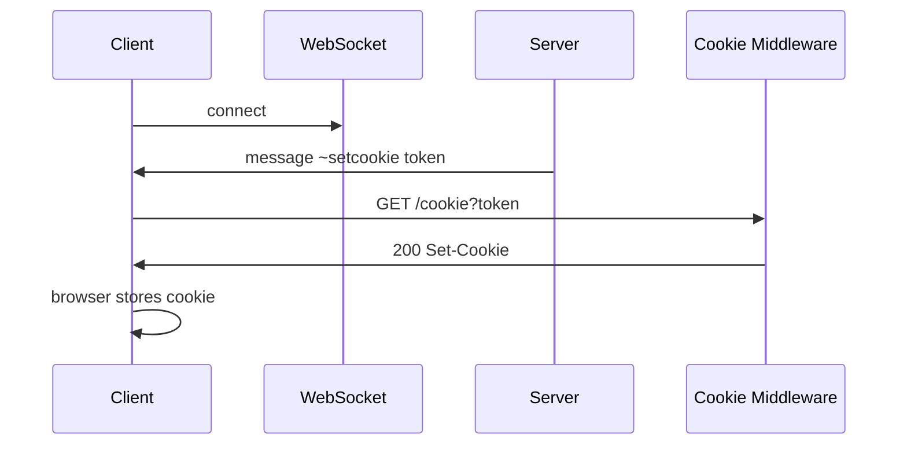

# insite-cookie

Cookie support for inSite — token-based handoff for setting cookies over WebSocket. Browsers do not expose `Set-Cookie` for WebSocket responses; this package uses a token handoff: server sends token via WS, client fetches HTTP endpoint with token, receives `Set-Cookie`.

Part of [inSite](../../README.md) — depends on [insite-users-server-ws](../users-server-ws/README.md), [insite-http](../http/README.md), [insite-ws](../ws/README.md), [insite-common](../common/README.md).

## Installation

```sh
npm install insite-cookie
```

Or:

```sh
bun add insite-cookie
```

## Overview



## Quick Start

**Server**

```ts
import { CookieSetter, CookieMiddleware } from "insite-cookie/server";
import { UsersServer } from "insite-users-server-ws";
import { HTTPServer } from "insite-http";

const usersServer = new UsersServer({ /* ... */ });
const cookieSetter = new CookieSetter({ usersServer });
const cookieMiddleware = new CookieMiddleware();

const http = new HTTPServer();
http.use(cookieMiddleware);
```

**Client**

```ts
import { CookieSetter } from "insite-cookie/client";
import { WS } from "insite-ws/client";

const ws = new WS({ url: "wss://example.com" });
new CookieSetter(ws, { url: "/cookie" });
```

Or use [insite-client](../client/README.md) with `cookie: {}`.

## API Reference

### Exports

**Server (`insite-cookie/server`):**

| Export | Type | Description |
|--------|------|-------------|
| `CookieSetter` | class | Sets cookies via token handoff; session sync on connect/session change |
| `CookieMiddleware` | class | HTTP middleware for `/cookie?token` |
| `parseCookie` | function | Parses cookie string to `Record<string, unknown>` |
| `CookieMiddlewareOptions` | type | CookieMiddleware constructor options |

**Client (`insite-cookie/client`):**

| Export | Type | Description |
|--------|------|-------------|
| `CookieSetter` | class | Listens for `~setcookie`, XHR to set cookies |
| `Options` | type | Constructor options |

**Types:** `Cookie` — `Record<string, string>`; `CookieOptions` — maxAge, expiresAt, domain, path, secure, httpOnly, sameSite

### CookieSetter (server)

```ts
class CookieSetter<AS extends AbilitiesSchema>
```

| Member | Signature | Description |
|--------|------------|-------------|
| constructor | `(options: Options<AS>)` | `usersServer` required; `domain` defaults to `process.env.INSITE_HOST`; `maxAge` defaults to session TTL |
| set | `(wssc, cookie, options) => void` | Queues cookie, sends token; client fetches URL for Set-Cookie |
| unset | `(wssc, names) => void` | Clears cookies by name |
| usersServer | `UsersServer<AS>` | Injected |
| domain | `string \| undefined` | Cookie domain |
| maxAge | `number` | Cookie max-age in seconds |
| parse | `static` | Alias for parseCookie |

### CookieMiddleware

```ts
class CookieMiddleware extends ClassMiddleware
```

| Member | Signature | Description |
|--------|------------|-------------|
| constructor | `(options?: CookieMiddlewareOptions)` | `path` defaults to `"/cookie"` |
| make | `static (arg: MakeArg) => string` | Builds Set-Cookie header |
| cookify | `static (cookie, options) => string[]` | Builds Set-Cookie array |

### CookieSetter (client)

| Member | Signature | Description |
|--------|------------|-------------|
| constructor | `(ws: WS, options?: Options)` | Subscribes to `~setcookie`; fetches `url?token` |
| method | `"GET" \| "POST"` | Default `"GET"` |
| url | `string` | Default `"/cookie"` |

**Options:** method, url, onload, onerror

## Related

- [insite-client](../client/README.md) — pass `cookie: {}` to enable
- [insite-users-server-ws](../users-server-ws/README.md) — server CookieSetter binds to client-connect, client-session
- [insite-http](../http/README.md), [insite-ws](../ws/README.md), [insite-common](../common/README.md)

## License

MIT
